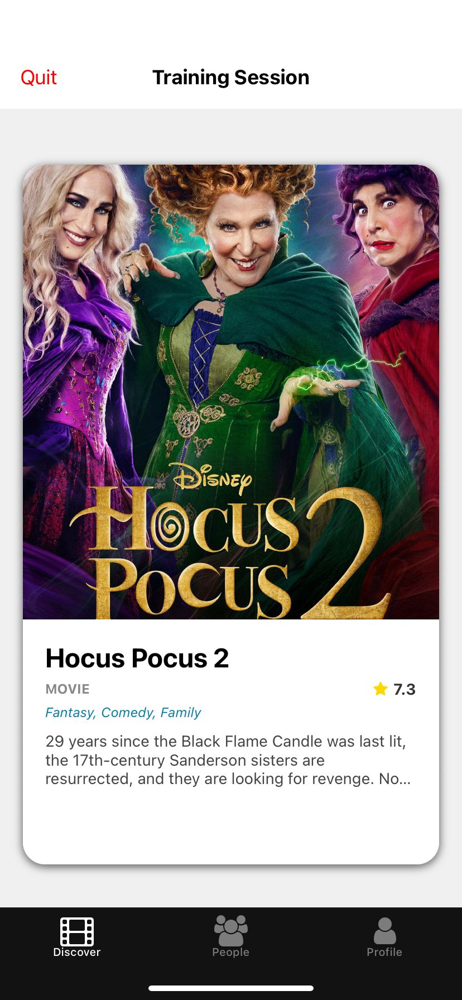
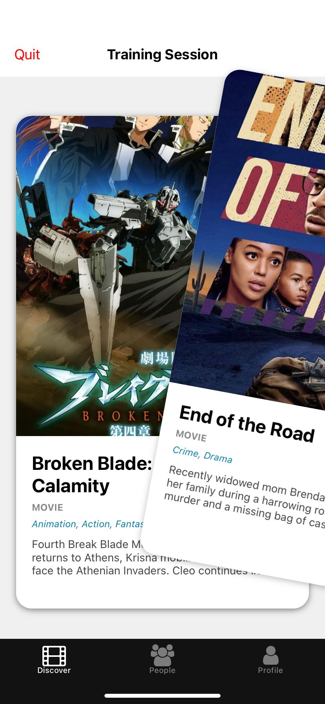
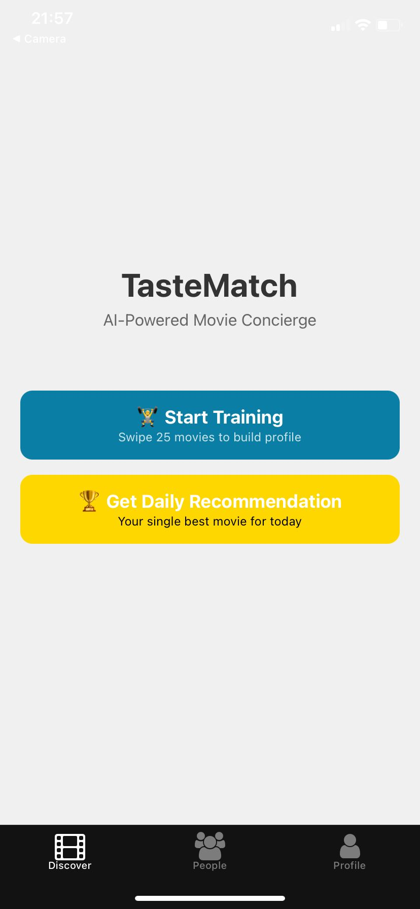
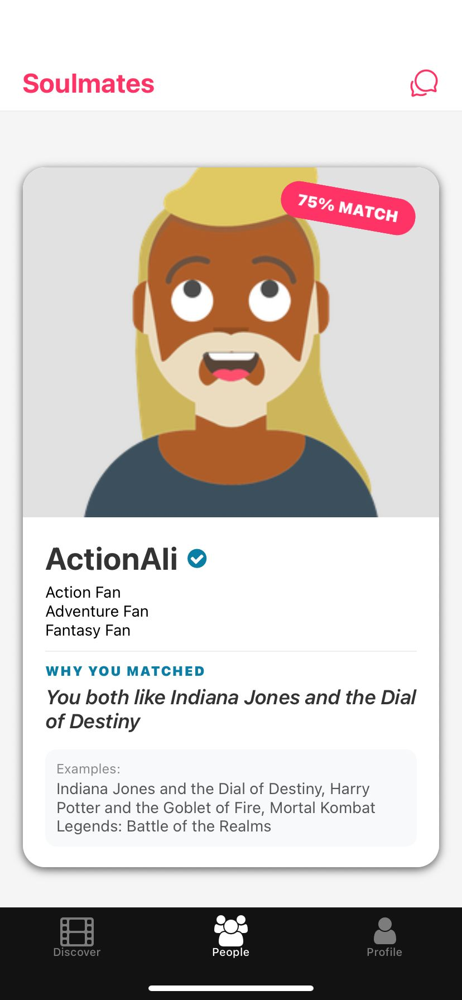
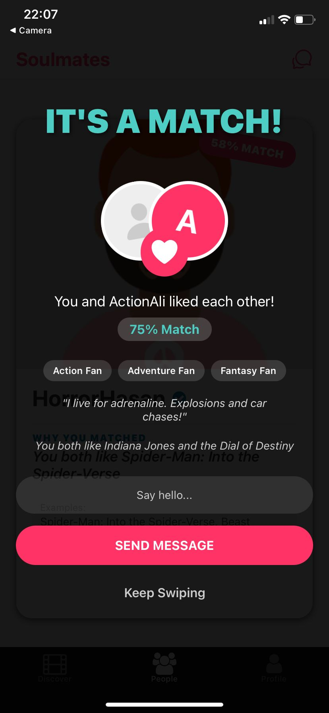
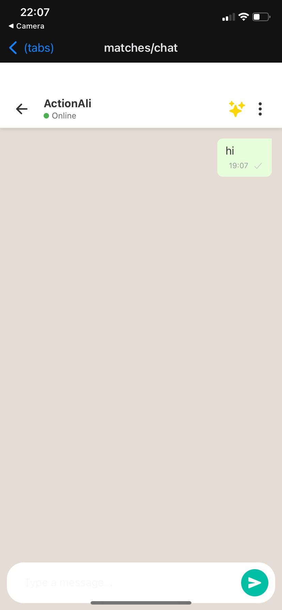
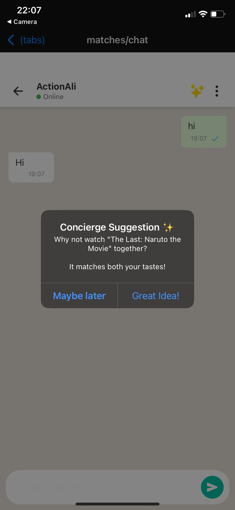

# TasteMatch - AI Powered Multi-Domain Dating App

**"Find Your Soulmate, Not Just a Date."**

TasteMatch is a "Taste Inference Engine" designed to connect people through shared passions in Films, Books, Music, and Food. Unlike swiping apps focused on quick hookups, TasteMatch is for those who believe that true compatibility comes from shared experiences and complementary vibes.

---

## 📖 The Story & Philosophy

**Why another dating app?**
Modern dating apps (Tinder, Bumble) have become endless catalogs of faces, often optimized for short-term validation. We built TasteMatch for people who want **validation for their soul, not just their selfies.**

1.  **The "Cinematic Soulmate" Excuse**: We give users a valid reason to seek a deeper connection. "I'm not here for a hookup; I matched with someone who also loves 90s Cyberpunk Movies and Soviet Sci-Fi." It changes the context from "Are they hot?" to "Do they *get* me?"
2.  **Beyond the Mirror**: While we start by matching similar tastes ("Mirror Match"), our vision recognizes that great relationships often come from differences. The "Complement Match" (e.g., You like Chaos, they like Order) and "Contrast Match" are designed to create friction and conversation, not just echo chambers.
3.  **The Authority of the Algorithm**: People are indecisive. TasteMatch aims to be the "Date Concierge." Instead of the awkward "Where should we go?", our AI will eventually say: *"You both love Italian food and hate crowded places. We booked a table at Mario's. Go."* We want users to trust the match because the math says it works.

---

## 🚧 Current Status & Roadmap

**Current Version:** 🎬 **Movie Domain Only**
The app currently profiles users based on their Movie tastes using a refined Two-Tower architecture trained on MovieLens data.

**Coming Soon:**
*   **📚 Books & 🎵 Music**: Ingesting Goodreads and Last.fm datasets to create a richer "Composite Soul Vector."
*   **🍔 Food**: Integration with venue APIs to enable the Date Concierge.
*   **🎮 Games**: For the gamer couples who want to co-op through life.

**Future Vision:**
*   **Date Concierge**: End-to-end date planning. "Watch *Inception*, then discuss it over coffee at *Third Wave Roasters*."
*   **Smart Icebreakers**: "Ask them about why they rated *The Room* 5 stars."

---

## 🚀 Key Features

*   **Multi-Domain Architecture**: 
     Ready to support Books, Music, and Food (currently active for Movies).
*   **Intelligent Matching**:
    *   **Mirror Match**: You share the exact same taste.
    *   **Complement Match**: Similar vibe, different genres (e.g., Hard Sci-Fi vs. High Fantasy).
    *   **Contrast Match**: Opposites that create spark.
*   **Shared Semantic Space**: 
    A unified 512-dimensional vector space where User and Item embeddings coexist.

---

## 📱 Visual Walkthrough

### 1. Training Your AI 🧠
Before you match with people, you match with *culture*. The **Training Session** is where you swipe on movies (and soon Books/Music) to build your unique **Soul Vector**.
<p align="center">
  
  
</p>

### 2. The Semantic Search 🔍
Once your profile is ready, our Multi-Domain Engine scans the vector space for users who don't just "look" like you, but *feel* like you.
<p align="center">
  
  
</p>

### 3. The Match Experience ✨
When you find a high-quality match (e.g., 90% compatibility), it's not random. It's based on shared deep interests.
<p align="center">
  
  
</p>

### 4. The Concierge & Icebreakers 🍸
No more "Hey". We provide context-aware icebreakers. And when you're ready to meet, the **Date Concierge** suggests a plan based on your shared tastes.
<p align="center">
  
  
</p>

---

## 🏗 System Architecture

TasteMatch uses a **Two-Tower Architecture** enhanced with **Weighted Taste Fusion** and **Vector Retrieval**.

### 1. Shared Semantic Space
Instead of separate silos for each interest, we map all users and items into a shared 512-dimensional space.
*   **User Tower**: Aggregates interaction histories from all domains (Movie, Book, etc.) into a single `Composite User Vector`.
*   **Item Towers**: Domain-specific encoders (e.g., BERT for Text, ResNet for Images, separate embeddings for ID) project items into the same space.

### 2. Inference Pipeline
1.  **Retrieval (ANN)**: Uses **ChromaDB** and **Two-Tower** indices to instantly fetch top-k candidates even from millions of items.
2.  **Filter**: Removes seen items and applies hard constraints (Geo-location for dates).
3.  **Ranking**: A pairwise interaction model (NCF/MLP) re-ranks candidates to maximize personal relevance.
4.  **Mixing**: The `MultiDomainInferenceService` fuses vectors:
    ```python
    Composite = Normalize( w_movie*V_movie + w_book*V_book + ... )
    ```

### 3. Tech Stack
*   **Backend**: Python, FastAPI, SQLAlchemy, SQLite (Development).
*   **AI/ML**: PyTorch, Sentence-Transformers, ChromaDB (Vector Store).
*   **Frontend**: React Native (Expo).
*   **DevOps**: Docker, Git LFS.

---

## 📦 Model Management (Git LFS)

We strictly use **Git LFS** to manage large model assets. **Only the best performing Production Models are tracked.**

*   `production_models/two_tower_retrieval_v1.pth`: Core retrieval engine.
*   `production_models/two_tower_ranker_v1.pth`: Precision ranking model.

intermediate checkpoints (`epoch_*.pth`) are **ignored** to keep the repository light.

---

## 🛠️ Setup & Installation

### Prerequisites
*   Python 3.9+
*   Node.js & npm
*   Git LFS
*   (Optional) Docker

### 1. Backend Setup

```bash
cd backend
python -m venv venv
# Windows
.\venv\Scripts\activate
# Linux/Mac
source venv/bin/activate

pip install -r requirements.txt
```

**Database & Migration:**
```bash
# 1. Update Schema for Multi-Domain support
python scripts/update_schema.py

# 2. Migrate legacy Movie Swipes to Unified Interaction Table
python scripts/migrate_swipes.py
```

**Run Server:**
```bash
uvicorn app.main:app --host 0.0.0.0 --port 8000 --reload
```

### 2. Frontend Setup

```bash
cd frontend2/tastematch
npm install
npx expo start
```

---

## 🤝 Contributing

1.  **Feature Branch**: Create a branch for your specific domain or feature (`feature/book-domain`).
2.  **Commit**: Use meaningful commit messages.
3.  **LFS**: Ensure you are NOT committing 1GB+ checkpoints unless they are the final `production_models`.
4.  **PR**: Submit a Pull Request to `master`.
